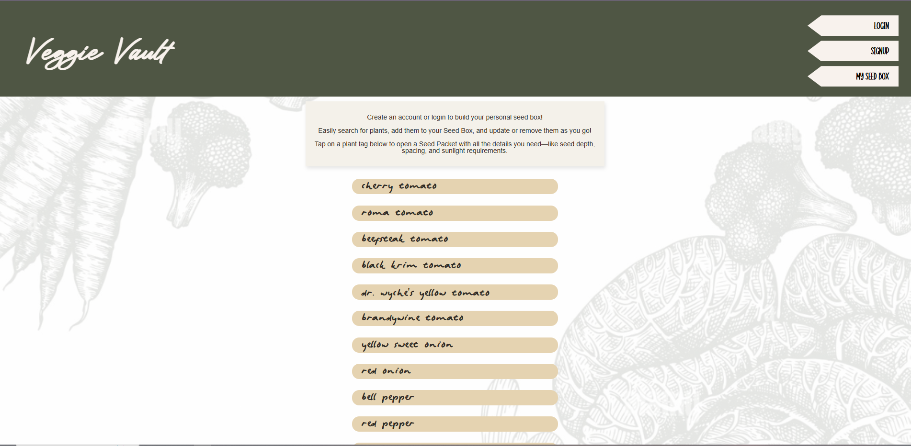

# VeggieVault - Garden Planting App

**VeggieVault** is a garden planting app designed to help users plan and manage their vegetable gardens effectively. It provides information on plant types, varieties, sowing dates, seed depths, and more. Users can create their personal seedbox to manage the seeds they are growing and easily reference their "seed packets" from anywhere. 

---

## Table of Contents

1. [Description](#description)
2. [Technologies](#technologies)
3. [Installation](#installation)
4. [Usage](#usage)
5. [Deployed Link](#deployed-link)
6. [License](#license)
7. [Contributing](#contributing)
8. [Contact](#contact)

---

## Description

VeggieVault is a full-stack garden seed planting application built with the MERN stack (MongoDB, Express.js, React, Node.js). This application allows users to:
- Search for plant types and varieties
- Add them to their virtual seedbox
- Track their sowing and planting schedules 
- View the specific plant type requirements
- Select sow date and add custom planting notes. 
- Plan according to frost-hardy conditions and other parameters

---

---

## Technologies

- **Frontend**: React.js, CSS (Custom Styling)
- **Backend**: Node.js, Express.js
- **Database**: MongoDB, Mongoose ODM
- **GraphQL**: Apollo Server for API queries and mutations
- **Authentication**: JWT (JSON Web Tokens)
- **Deployment**: Render (Frontend and Backend)
- **Version Control**: Git and GitHub

---

## Installation

### Prerequisites

Before installing the app, ensure that you have the following software installed:
- [Node.js]
- [MongoDB]
- [apollographql]
  
### Clone the Repository

1. Clone this repository to your local machine:

git clone https://github.com/JCollver23/VeggieVault

2. Navigate into project folder:

`cd veggievault`

### Setup

1. Build command

`npm install`; `npm run build`; `npm run seed`

2. Start Command

`npm run server`

---

## Usage

Once the app is up and running, navigate to the URL provided by your local server (typically `http://localhost:3000`) in your web browser.

- **Home Page**: Explore plant varieties and add them to your seedbox.
- **My Seed Box**: View and manage your saved plant entries, including sowing dates, water requirements, etc.
- **Search Functionality**: Search for specific plants or varieties and add them to your seedbox.

The app will authenticate users via JWT, allowing them to securely access and manage their seed box.

## Deployed Link

Check out **VeggieVault** live and in action!  
🌱 [Click here to visit the deployed app on Render](https://veggievault.onrender.com/) 🌱  
Start planning your dream garden right from your browser—anytime, anywhere.

## License

This project is licensed under the MIT License - see the LICENSE file for details.

## Contributing

We welcome contributions from the community! If you’d like to improve this project, please follow these steps:

1. Fork the repository.
2. Create a new branch (`git checkout -b feature-branch`).
3. Make your changes and commit them (`git add -A`)(`git commit -m 'Add new feature'`).
4. Push to your branch (`git push origin feature-branch`).
5. Open a pull request.

Please ensure that your code adheres to our coding standards, and add tests where applicable.

## Contact

For any questions or issues, contact us at:

- **Email**: jessicaherborn@gmail.com
- **GitHub**: [https://github.com/JCollver23]
